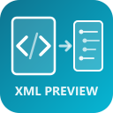

#  WPF XML Preview

A Visual Studio Code extension that brings **WPF-style visual rendering** to your XML files. See your UI markup come to life in real time as you type — no compilation, no build step.


[](https://marketplace.visualstudio.com/items?itemName=stescobedo.wpf-xml-preview)

## The Problem

Working with XML-based UI definitions (WPF, XAML, custom frameworks) in VS Code means you're staring at raw markup with no visual feedback. You write a `<Button>`, a `<Grid>`, a `<StackPanel>` — but you can't see what it looks like until you compile and run the entire application. This slows down the design-develop-iterate cycle significantly.

## The Solution

**WPF XML Preview** renders your XML controls as interactive visual components directly inside VS Code. It recognizes common WPF/XAML elements and draws them with realistic styling — buttons look like buttons, text boxes look like text boxes, grids lay out their children, and tab controls show tabs.

## Features

### WPF Visual Mode (Default)
Renders XML elements as styled UI controls:

| XML Element | Visual Rendering |
|---|---|
| `<Window>` | Window frame with title bar, min/max/close buttons |
| `<Button>` | Styled button (supports `Style="Primary"`) |
| `<TextBox>` | Input field with placeholder text |
| `<PasswordBox>` | Password input (masked) |
| `<CheckBox>` | Checkbox with label |
| `<RadioButton>` | Radio button with group support |
| `<ComboBox>` | Dropdown select with items |
| `<ListBox>` | Scrollable list |
| `<Slider>` | Range slider |
| `<ProgressBar>` | Progress indicator |
| `<TextBlock>` | Text with font size/weight support |
| `<Label>` | Simple text label |
| `<Grid>` | Grid layout container |
| `<StackPanel>` | Vertical/horizontal stack layout |
| `<DockPanel>` | Dock layout |
| `<WrapPanel>` | Wrap layout |
| `<TabControl>` | Tabbed interface with content |
| `<GroupBox>` | Bordered group with header |
| `<Expander>` | Collapsible section |
| `<Menu>` / `<MenuItem>` | Menu bar with items |
| `<StatusBar>` | Status bar (styled like VS/WPF) |
| `<DataGrid>` | Table with column headers |
| `<Border>` | Configurable border container |
| `<Separator>` | Horizontal divider |
| `<Image>` | Image placeholder |

### Tree View Mode
Toggle to a hierarchical XML tree with:
- Collapsible nodes
- Syntax-colored tag names, attributes, and values
- Inline text content display

### Real-Time Sync
- **300ms debounce** — updates after you stop typing, not on every keystroke
- **Error resilience** — keeps the last valid render visible when XML has syntax errors
- **Auto-switch** — follows your active editor when you switch between XML files

### Two Ways to Preview
1. **Activity Bar** — dedicated icon in the left sidebar for always-visible preview
2. **Editor Panel** — side-by-side panel next to your editor (`Ctrl+Shift+V`)

### Theme Integration
Uses VS Code's native CSS variables (`--vscode-editor-foreground`, `--vscode-input-background`, etc.) so the preview adapts to any theme — dark, light, or high contrast.

## Installation

### From VSIX (Local)
```bash
code --install-extension wpf-xml-preview-1.0.0.vsix
```

### From Source
```bash
git clone https://github.com/stescobedo92/vscode-wpf-xml-preview.git
cd vscode-wpf-xml-preview
npm install
npm run compile
```
Then press `F5` in VS Code to launch the Extension Development Host.

## Usage

1. Open any `.xml` file
2. Click the **XML Live Preview** icon in the Activity Bar (left sidebar), or press `Ctrl+Shift+V`
3. Edit your XML — the preview updates in real time
4. Use the **WPF / Tree** toggle button to switch between visual and tree modes
5. Use **Expand / Collapse** buttons to control node visibility

## Keyboard Shortcuts

| Shortcut | Action |
|---|---|
| `Ctrl+Shift+V` | Open preview panel |
| Click activity bar icon | Open sidebar preview |

## Sample Files

The extension includes sample XML files to get started:

- `samples/wpf-login-form.xml` — Login form with inputs, tabs, radio buttons, progress bar
- `samples/wpf-dashboard.xml` — Dashboard with menus, expanders, data grid, stats panels

## Supported Attributes

The renderer recognizes common WPF attributes:

- **Layout**: `Width`, `Height`, `Margin`, `Padding`, `Orientation`, `Rows`, `Columns`
- **Content**: `Text`, `Content`, `Header`, `Label`, `Placeholder`, `Title`
- **Style**: `FontSize`, `FontWeight`, `Foreground`, `Background`, `BorderBrush`, `BorderThickness`, `CornerRadius`
- **State**: `IsChecked`, `IsEnabled`, `IsExpanded`, `IsSelected`, `IsDefault`, `IsReadOnly`
- **Data**: `Value`, `Minimum`, `Maximum`, `SelectedItem`, `GroupName`, `Binding`

## Requirements

- VS Code 1.85 or higher
- No additional dependencies required

## Contributing

Contributions are welcome! Please open an issue or submit a pull request on [GitHub](https://github.com/stescobedo92/vscode-wpf-xml-preview).

## License

MIT License - see [LICENSE](LICENSE) for details.

## Contributors

- [Sergio Triana Escobedo](https://github.com/stescobedo92)
